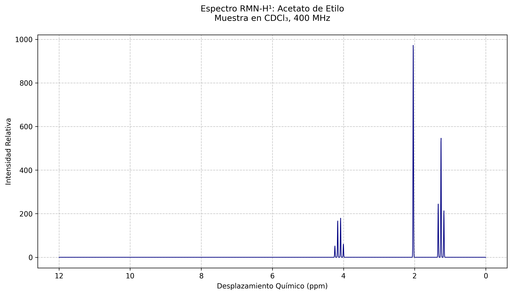

## Graficador de Espectros RMN

Este proyecto es una herramienta para generar espectros simulados de Resonancia Magnética Nuclear (RMN) a partir de datos experimentales. Está diseñado específicamente para espectros de H¹ en muestras como acetato de etilo, utilizando archivos CSV con los datos de picos e intensidades.

## Vizualizacion 

## Caracteristicas 

Generación de espectros RMN: Crea gráficos basados en datos experimentales.
Estilo personalizable: Configuración visual para gráficos claros y legibles.
Manejo de errores: Verificación de la existencia del archivo de datos antes de procesarlo.
Resultados exportables: Guarda el espectro generado como una imagen en la carpeta resultados_rmn.

## Requisitos

Python 3.8 o superior.
Librerías:
numpy
pandas
matplotlib
Archivo de datos ethyl acetate_NMR.csv en la carpeta raíz del proyecto.

## Estructura del proyecto

├── RMN2.py       

├── ethyl acetate_NMR.csv 

├── resultados_rmn/  

## Contribuciones

Si deseas contribuir al proyecto, abre un issue o realiza un pull request en este repositorio.
